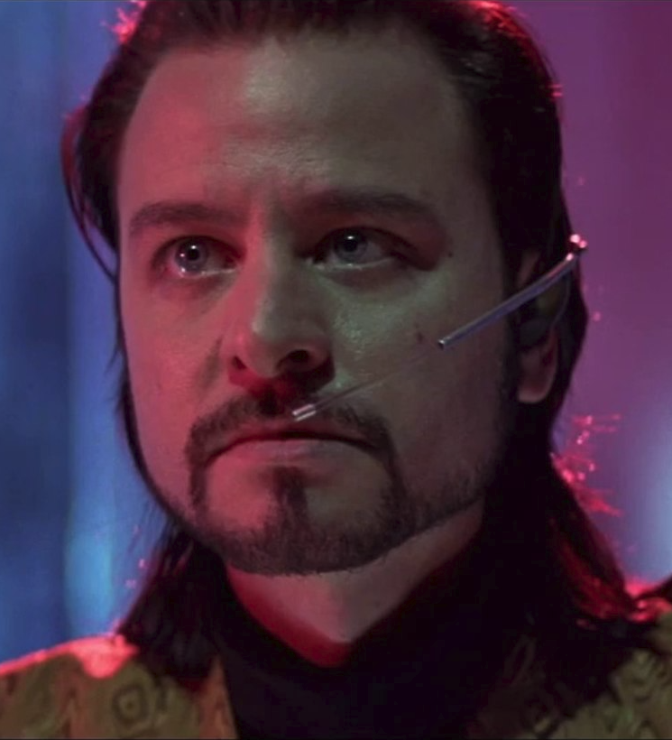

# EscapeCodeImages
Converts images to ansi escape codes for more interesting MOTD Banners

Couple of things going on here:

  -Foreground characters are ` .-+*#%@$` to simulate luminance
  
  -Foreground colours are selected by sampling the upper half of a vertical pxel "doublet"
  
  -Background colours are selected by sampling the bottom half of the same

That's about it.
Simple images will give more usable results depending on the system hosting.

This converter produces reams of text looking like this:
```[38;2;99;52;96m------------------```

^^^that's one line!

(Cisco switches will crap out about halfway through a decent image because of the sheer amount of characters required to write an escape code. A partial workaround for these platforms is to split the banenr between "Login" and "MOTD", which doubles the available character space)

Usage terminal3.py image_path [width]

Converting an image of The Plague:



Ends up looking like this:


The luminance effect is subtle, but really adds a lot of image detail when compared with background block conversion to colour values or even common techniques like splitting the forground in hald using that wierd unicode half blopck thing letting you double the vertical resolution.

 
